# TAXII-springboot
SpringBoot implementation of TAXII server

This provides a full spec compliant TAXII implementation based on SpringBoot and a workflow engine.

This library is used as the primary building block for TAXII server implementations.  
Most implementations implement customized security configurations and workflow configurations.  
These configurations typically do not require changes to core code, rather are BPMN deployments within the workflow 
engine (Camunda), and Spring Security configurations.

This TAXII server is designed to be used as a configurable microservice that can scale and configure for simple and complex processing requirements.

# Related Projects

1. See [TAXII-Worker](https://github.com/StephenOTT/TAXII-Worker) for a Vertx based polymophic External Task worker that is non-blocking, scalable and cluster ready.  This lib can be used as a base to build a customized workers or can be used as a Main Verticle to deploy other verticles and establish a central Vertx hub. 
2. See [STIX-Java](https://github.com/StephenOTT/STIX-Java) for the STIX library that this TAXII server is based on.

# Configuration

Configuration is part of the Springboot application.yaml:

```yaml
server:
  port: 8090

spring:
  data:
    mongodb:
      host: localhost
      port: 27017
      database: taxii

camunda:
  bpm:
    admin-user:
      id: admin
      password: admin
      firstName: Admin

taxii:
  tenant:
    slug: "admin"
    title: "administration tenant"
    description: "The admin tenant for overall management of the taxii server"

  discovery:
    title: "My default Discovery"
    description: "The default discovery"

  user:
    username: "admin"
    password: "admin"
   
  basic-auth:
    enabled: "true"

```

# Multi-Tenant Support

Full and flexible Multi-Tenant support is provided.
This support provides the ability to completely segregate data based on DB, or have hybrid models with shared Shared or partially shared data.
By default, a partially shared hybrid Multi-Tenant Model is implemented:

- Users, Tenants, Discovery, and User Roles are stored in a centralized "default" database
- Each Tenant has their data in their own DB with Collections, Collection Objects, Statuses, and Collection Membership Records.

## User Roles

The User Roles represent a User's membership with a Tenant.  The existence of a UserRoleDocument for a specific User for a specific Tenant, represents their membership in that tenant.
A User may have membership but have no roles in that tenant.

## URL Path Pattern for Tenants

In TAXII spec a tenant is referred to as a "root".  As a example the path becomes for accessing all of the collections for a tenant:
 
GET  `/taxii/tenant/:tenantslug/collections`

## Discovery

The GET `/taxii` endpoint which the TAXII spec defines as the "Discovery" endpoint will search for all Tenant Memberships (UserRoleDocuments) that the current user is apart of and return a response such as:

```json
{
    "tenant_id": "tenant1234",
    "tenant_slug": "mytenant2",
    "title": "administration tenant2",
    "description": "The admin2 tenant for overall management of the taxii server",
    "versions": [
        "taxii-2.0"
    ],
    "max_content_length": 10485760
}
```

## TenantId vs TenantSlug

`TenantId` is the unique ID of the tenant which is used in the DB Name, and in cross-document references.
The id is provided as a configurable value so DB names can have meaningful names rather than generic UUIDs.

`TenantSlug` is the URL path value used to reference the tenant.  The `TenantSlug` is the "human-value".

## TenantId References on all Documents

All DB documents that are stored have TenantID values even when the document is isolated within its own tenant.
This is done to provide options to implementor for single tenant vs Multi-tenant.
Any custom document types that are created should follow this same rule.


# BPMN Usage examples

Base processes that loaded into the engine to handle typical processing.

Additional processes can be enacted as needed for the specific implementation.


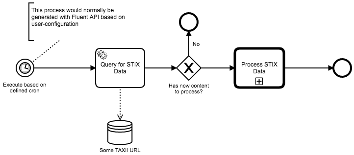

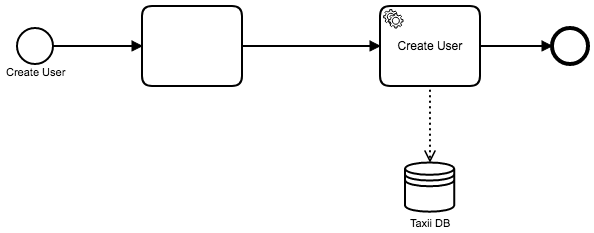

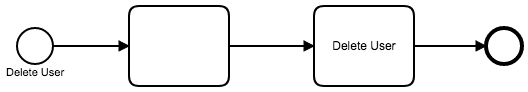

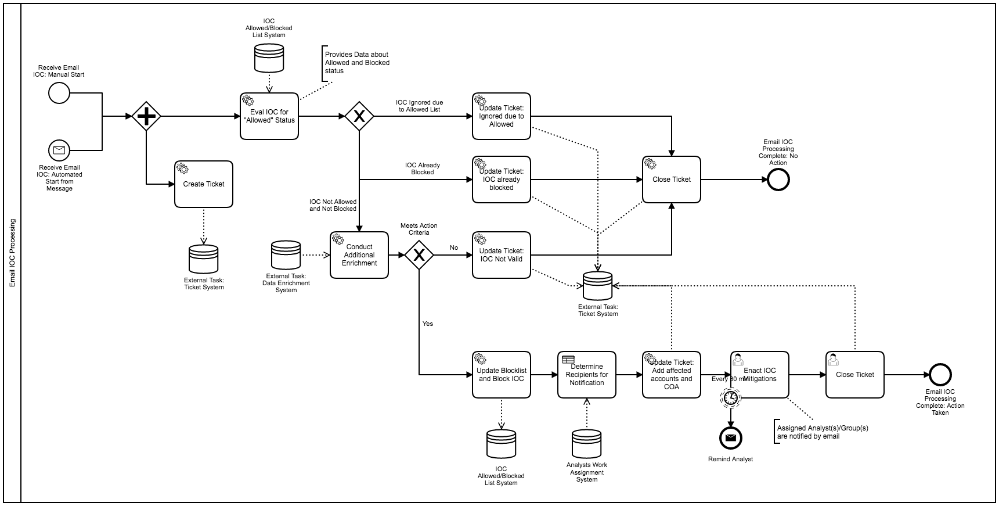

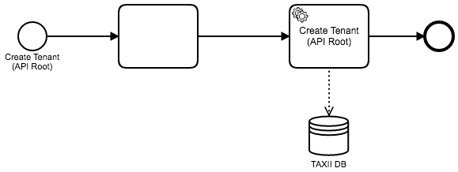


## Example Sub-Implementations

1. Processing Redacted Content

1. Processing Content requiring translation

1. Identification of problematic content requiring manual review before processing into taxii collections

1. Version control of Taxii Data: handling scenarios of Duplicate ID + Same Modified Dates, Duplicate ID + Different modified Dates, etc.

1. Notification of specific user access

1. Complex Harvesting and conversions: Harvesting from non-STIX source into STIX and processing into local or remote TAXII DB or TAXII HTTP source.

1. Life-cycle old STIX data requiring review or removal

1. Layering TAXII servers to manage processing load: Intake Server + Processing Server + Storage Server: All implementations of the same core springboot Taxii server, but each with their own deployments.

1. Process submitted data into third-party systems that are non-TAXII servers (servers, files, csv, file systems, RPC, HTTP, etc).


# Basic-Auth

Basic Authentication is enabled by default.  Authentication uses the Taxii Users' username and encoded passwords.

You can disable it in the application.yaml file with:

```yaml
taxii:
  basic-auth:
    enabled: false
```

if Basic Auth is disabled there will be a warning message on application startup:

`WARN 5583 --- [           main] i.d.t.security.TaxiiSecurityProvider     : TAXII BASIC-AUTH SECURITY IS DISABLED!!`


See the `io.digitalstate.taxii.security` package for further configuration capabilities.


# Docker Image

...


# Building a Customized Fat-Jar

...

# Security Configurations

## HTTPS

## Admin User

## Workflow Engine Admin

## Basic Auth


# STIX Redaction processing

The STIX library provides redaction support.  
Redacted STIX data could result in JSON that is non-compliant to the spec, such as missing required fields.  
The typical processing pattern for possibly redacted content is to attempt processing of each object, and in places 
where processing of the individual object 'fails', the object will be marked for manual processing and review.

Example:


# Sharable Workflows: Actions based on STIX Data

This microservice can be used to create a processing engine for STIX Data that is consumed from a TAXII or any other STIX (or even non-STIX) data source.  
The goal of this capability is to provide "Sharable Workflows" of processes that handle actioning based on STIX data such as Cyber Observables.

Consider a Email Indicator of Compromise such as:


This process can be triggered based on logic within the TAXII engine or be a message received from another TAXII server.  

A sharable workflow can be used as a reusable template that is executable within the workflow engine.

The workflow engine can execute the bpmn and each implementor can choose their execution language for each task with the 
External Task Model, or using the script engine support within the workflow engine.

1. External Task Model: setup where tasks that require action, generate "work", which is picked up by external services 
(in any language) through REST, and the external service actions the chunk of work and returns the result(s).

1. Scripting Engine Support: setup where tasks are executed within the workflow engine using Java or a scripting engine.  
Any scripting engine that can integrate with JVM can be used, such as:
   1. <strong>Python</strong>
   1. Groovy
   1. Ruby
   1. JavaScript
   
   
# Adding Custom REST Endpoints

...


# Endpoints

The default endpoints for Taxii + administrative endpoints that are beyond the core Taxii spec.

:exclamation: endpoints are subject to change without notice at this time. 

## Discovery

### `/taxii`

## Tenants (API-Roots)

...

### GET `/taxii/tanant/:tenant_slug`

...

## Users

...

### GET `/taxii/tanant/:tenant_slug/users`

...

### GET `/taxii/tanant/:tenant_slug/users/user_id`

...

## Collections

...


### GET `/taxii/tanant/:tenant_slug/collections`

...


### GET `/taxii/tanant/:tenant_slug/collections/collection_id`

...


### GET `/taxii/tanant/:tenant_slug/collections/collection_id/objects`

...


### POST `/taxii/tanant/:tenant_slug/collections/collection_id/objects`

...


## Status

...


### GET `/taxii/tanant/:tenant_slug/status/:statusId`

...


### PUT /taxii/tanant/:tenant_slug/status/:statusId/operations

An adminstrative endpoint.  Subject to change without notice.  Not part of the Taxii Spec.

...

Query Params:

All three params are required.

1. `operator`: `add`, `subtract`
1. `property`: 
    1. `up_success_count_down_failure_count`
    1. `up_success_count_down_pending_count`
    1. `up_pending_count_down_failure_count`
    1. `up_failure_count_down_pending_count`
    1. `failure_count`
    1. `pending_count`
    1. `successes`
    1. `failures`
    1. `pendings`
    1. `failure_count`
    1. `pending_count`
    1. `failures`
    1. `pending`
    
1. `value`: count properties require Number >= 1.  Internally converted to Long / int64.  non-count properties are converted to String and will enforce UUID formats.


# Example Usage

Given a request such as **POST** `http://localhost:8090/taxii/tenant/tenant123/collections/1c4bf1bc-71e6-40fc-b11a-708ec341e4ce/objects`

with a JSON body of:

```json
{  
  "type": "bundle",
  "id": "bundle--123-123-123-123",
  "objects": [
    {
        "type" : "attack-pattern",
        "id" : "attack-pattern--111-111-111-111",
        "created" : "2019-01-09T20:26:11.978Z",
        "modified" : "2019-01-15T15:19:33.564Z",
        "revoked" : false,
        "name" : "some AttackPattern generated through POST"
    },
    {
        "type" : "indicator",
        "id" : "indicator--111-111-111-111",
        "created" : "2019-01-09T20:26:11.978Z",
        "modified" : "2019-01-15T15:19:33.564Z",
        "revoked" : false,
        "name" : "Some Indicator",
        "labels": ["anomalous-activity"],
        "pattern": "some pattern goes here",
        "valid_from":"2019-01-01T09:00:00.000Z"
    }
  ]
}
```

The reponse is:

```json
{
    "id": "9afc285f-7134-48e0-88c1-548f9c439f89",
    "status": "pending",
    "request_timestamp": "2019-01-15T17:05:06.910Z",
    "total_count": 2,
    "success_count": 0,
    "successes": [],
    "failure_count": 0,
    "failures": [],
    "pending_count": 2,
    "pendings": []
}
```

This default response acknowledges the POST and does a count of the number of objects that the bundle contains.

Within the Taxii Server, the workflow has executed to begin processing the bundle:

We can review the state of the workflow and inspect its progress:

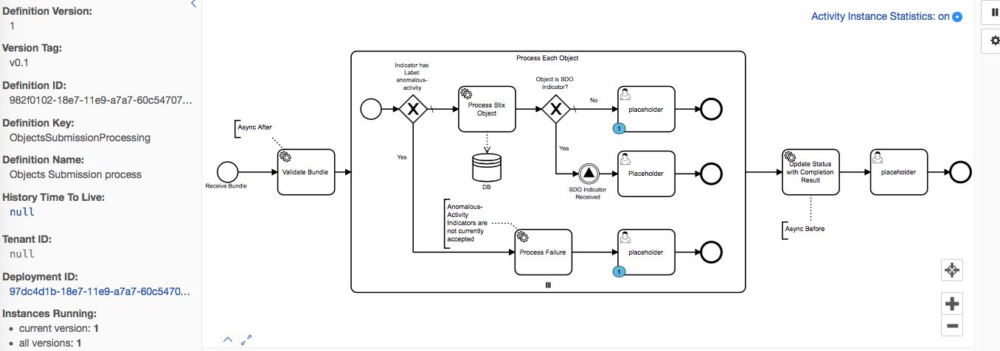

We can see the process has two active parallel tokens (executions).

Each STIX object within the bundle is a execution within the parent process isntance.  Therefore we have 2 executions because we submitted a bundle with two objects.

We can review the BPMN to see some of the specific configurations that were made:

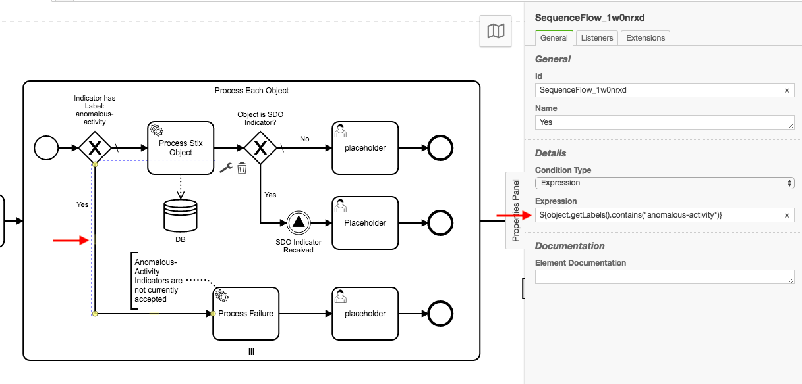

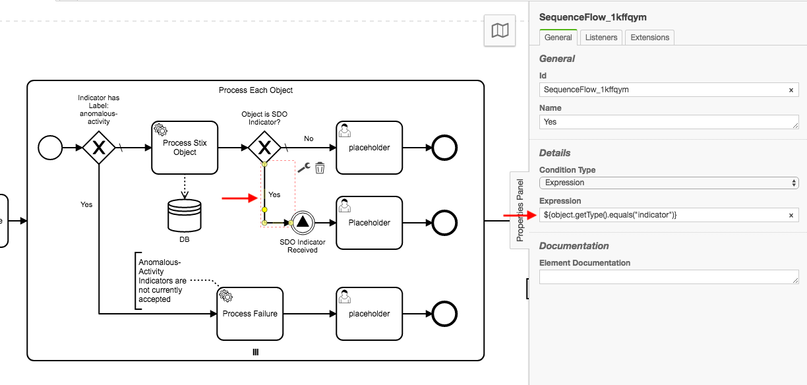

Notice that we are able to interact with the JSON/STIX Objects in a native type-safe java object using Java Expressions.
This gives us the full power of scripting and Java Expression Language to create powerful logic controls on how to process STIX data.

If we look at the Status through HTTP we can see the results of the BPMN processing: 

**GET** `http://localhost:8090/taxii/tenant/tenant123/status/b28e2ed1-26eb-4cc1-a1d6-e6bdecc72dae`

```json
{
    "id": "9afc285f-7134-48e0-88c1-548f9c439f89",
    "status": "pending",
    "request_timestamp": "2019-01-15T17:05:06.910Z",
    "total_count": 2,
    "success_count": 1,
    "successes": [
        "attack-pattern--111-111-111-111"
    ],
    "failure_count": 1,
    "failures": [
        {
            "id": "indicator--111-111-111-111",
            "message": "Anomalous Activity is not currently accepted"
        }
    ],
    "pending_count": 0,
    "pendings": []
}
```

Note the `failures` property which has the message that was defined in the BPMN configuration.

We use modeler templates that are configured for the expected inputs of the executing code.
For Failure Processing we have a expected input of `message` which is the message that should be provided for a STIX object that cannot be processed.

The configuration is:

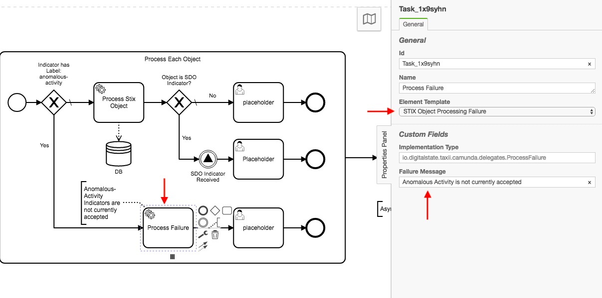

Templates provide a json configurable way to setup Analyst-friendly interfaces that can be configured without having to understand underlying complexities.


In the example we have "placeholder" Human Tasks in the BPMN which are used for demonstration purposes.
Once we complete those human tasks, the Update Status service task executes to update the Status with a `completed` status.

If an error occurs in the BPMN processing, the engine will provide full details and notifications about the incident:

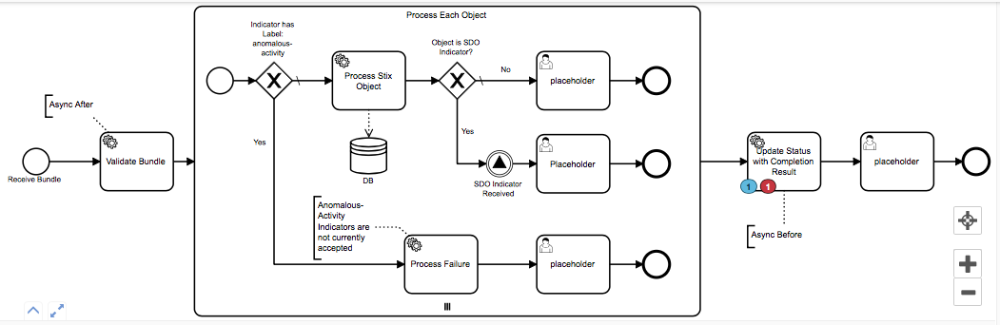

If no errors then the resulting BPMN would look like:

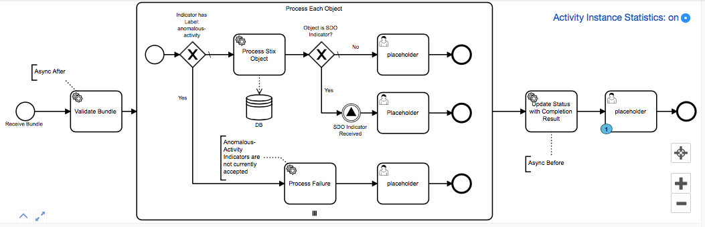

and the resulting JSON would be:

**GET** `http://localhost:8090/taxii/tenant/tenant123/status/9afc285f-7134-48e0-88c1-548f9c439f89`

```json
 {
    "id": "9afc285f-7134-48e0-88c1-548f9c439f89",
    "status": "completed",
    "request_timestamp": "2019-01-15T17:05:06.910Z",
    "total_count": 2,
    "success_count": 1,
    "successes": [
        "attack-pattern--111-111-111-111"
    ],
    "failure_count": 1,
    "failures": [
        {
            "id": "indicator--111-111-111-111",
            "message": "Anomalous Activity is not currently accepted"
        }
    ],
    "pending_count": 0,
    "pendings": []
}
```

Note the change in the `status` property.